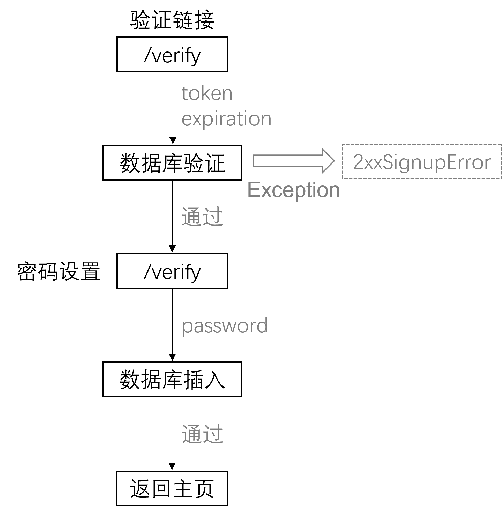

# NPC Blog

## 网址

http://blog.zx2624.co

**以下内容待更新...**

## MyBatis Plus 使用

### 相关网站

官方网站及教程： https://baomidou.com/

### 分页实现

```java
QueryWrapper<Question> queryWrapper=new QueryWrapper<Question>()
        .orderByDesc("id")
        .last(String.format("limit %d, %d",offset,size));
List<Question> questions=questionMapper.selectList(queryWrapper);
```
等同于：`select * from question order by id desc limit #{offset}, #{size}`

### Generator 使用

*建议使用 mybatis-plus-generato 3.5.1*

```java
public class MybatisPlusGenerator {


    public static void main(String[] args) {
        String url = "jdbc:mysql://127.0.0.1:3306/blog";
        String username = "username";
        String password = "password";

        FastAutoGenerator.create(url, username, password)
                .globalConfig(builder -> {
                    builder.author("NPC")                       // 作者名
                            .disableOpenDir()                   // 完成后不打开文件夹
                            .enableSwagger()                    // 开启 swagger 模式
                            .fileOverride()                     // 覆盖源文件（注意检查有无同名文件或需要保留源文件）
                            .outputDir("src\\main\\java");      // 文件生成地址
                })
                .packageConfig(builder -> {
                    builder.parent("com.example.blognpc")       // 父 package
                            .entity("model")                    // 实体文件夹名，默认为 entity
                            .pathInfo(Collections.singletonMap(OutputFile.mapperXml, "src\\main\\resources\\mapper"));
                                                                // mapperXml 文件生成地址（我在项目里面根本没用到 xml）
                })
                .strategyConfig(builder -> {
                    builder.addInclude("user")                  // 添加需要生成代码的数据库表
                            .addInclude("question")             // 同上
                            .addInclude("comment")              // 同上
                            .mapperBuilder()                    
                            .enableMapperAnnotation();          // 为 mapper 文件加上 @mapper 标注
                })
                .templateConfig(builder -> {
                                                        
                    builder.service("")                         // 不生成 service 文件
                            .serviceImpl("")                    // 不生成 serviceImp 文件
                            .controller("");                    // 不生成 controller 文件
                })
                .templateEngine(new FreemarkerTemplateEngine())
                .execute();
    }
}
```

代码生成器配置： https://baomidou.com/pages/981406/

---

## 发送邮件

### 相关教程

~~并没有找到较为官方的教程，下面一个是我参考的教程~~

知乎教程： https://zhuanlan.zhihu.com/p/234380542

### 快速上手

1. 在 qq 邮箱中开启 **IMAP/SMTP 服务**，并生成授权码，记录在 `application.properties` 中，如下
    ```
    spring.mail.host=smtp.qq.com
    spring.mail.username=youremail@qq.com
    spring.mail.password=authorizepassword
    spring.mail.port=465
    spring.mail.properties.mail.smtp.socketFactory.class=javax.net.ssl.SSLSocketFactory
    spring.mail.properties.mail.smtp.auth=true
    spring.mail.properties.mail.smtp.starttls.enable=true
    spring.mail.properties.mail.smtp.starttls.required=true
    ```

2. 在 `test` 中进行测试

    ```java
    @Autowired
    private JavaMailSender mailSender;
    
    @Test
    public void emailTest() {
        SimpleMailMessage message = new SimpleMailMessage();
        message.setFrom("from@email.com");
        message.setTo("to@email.com");
        message.setSubject("it is a test for spring boot");
        message.setText("测试发送邮件。");
    
        try {
            mailSender.send(message);
        } catch (MailException e) {
            e.printStackTrace();
        }
    }
    ```

### 邮件错误代码总表

CSDN： https://blog.csdn.net/qq_43442102/article/details/102743947

---

## 登录注册功能实现

### 总体逻辑


*------我是分割线------*



## 参考资料

- [moment format](http://momentjs.cn/docs/displaying/format.html)


